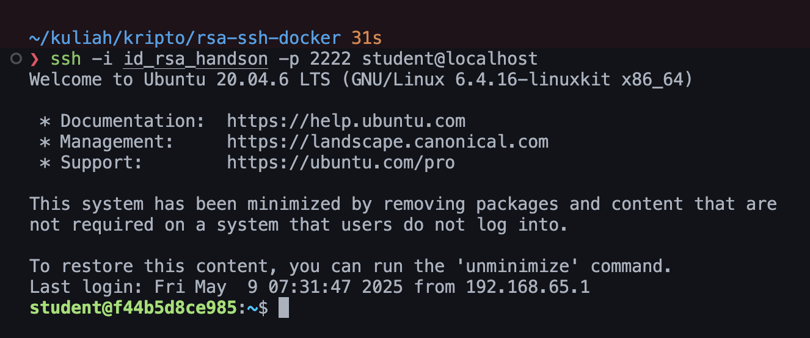

1. Keuntungan RSA key dibanding password:

   - Lebih aman karena menggunakan kriptografi asimetris (public-private key pair)
   - Tidak perlu mengingat password yang kompleks
   - Dapat digunakan untuk multiple server tanpa perlu password berbeda
   - Tidak rentan terhadap serangan brute force atau dictionary attack
   - Dapat di-revoke dengan mudah jika diperlukan

2. Mengapa private key harus dirahasiakan:

   - Private key adalah kunci untuk membuktikan identitas Anda
   - Siapapun yang memiliki private key dapat mengakses server yang menggunakan public key terkait
   - Private key tidak dapat di-recover jika hilang
   - Private key harus dilindungi dengan permission yang tepat (600)

3. Bagaimana kriptografi RSA bekerja dalam proses login SSH:
   - Server menyimpan public key di authorized_keys
   - Client menyimpan private key
   - Saat login:
     1. Client mengirim request login dengan username
     2. Server mengirim challenge (random number)
     3. Client mengenkripsi challenge menggunakan private key
     4. Server memverifikasi dengan public key
     5. Jika verifikasi berhasil, login diterima
4. Risiko jika file id_rsa bocor:
   - Penyerang dapat mengakses semua server yang menggunakan public key terkait
   - Penyerang dapat melakukan privilege escalation
   - Penyerang dapat melakukan lateral movement ke server lain
   - Penyerang dapat melakukan data exfiltration
   - Penyerang dapat melakukan malicious activities atas nama Anda

Best Practices untuk mencegah kebocoran private key:

1. Selalu set permission 600 pada private key
2. Jangan simpan private key di tempat yang mudah diakses
3. Gunakan passphrase untuk mengenkripsi private key
4. Rotasi key secara berkala
5. Segera revoke key yang dicurigai bocor
6. Gunakan key management system untuk organisasi besar
